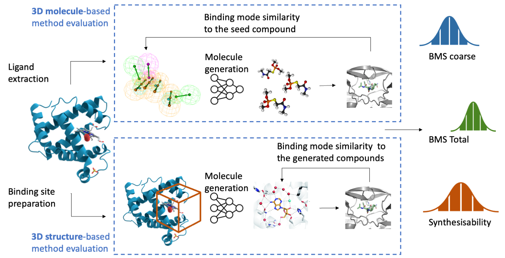

# DrugPose: Benchmarking 3D generative methods for early stage drug discovery

## Data availability

Relevant data can be downloaded from PDBBind: http://www.pdbbind.org.cn/ and it should be uploaded to PDBBind folder.

## Models

Each of the model should be downloaded and the individual environments should be set up separately for each model:

- Ligdream: https://github.com/playmolecule/ligdream
- SQUID: https://github.com/keiradams/SQUID
- Pocket2mol: https://github.com/pengxingang/Pocket2Mol

## Running the models

### Running the models on the PDBbind
Once the repos are set up you can run the relevant scripts for Ligdream, SQUID and Pocket2mol models, by running the files in generation folder.

### Running the docking and evaluation scripts
For running the docking and analysis scripts set up a new environment and run the docking scripts. Once the molecules are generated you can run the analysis scripts and specifying the directories in the folder.

